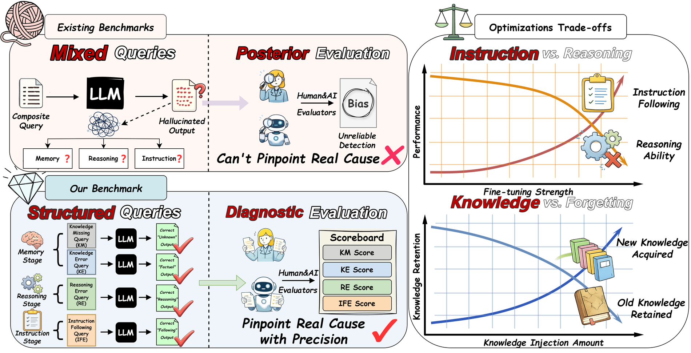
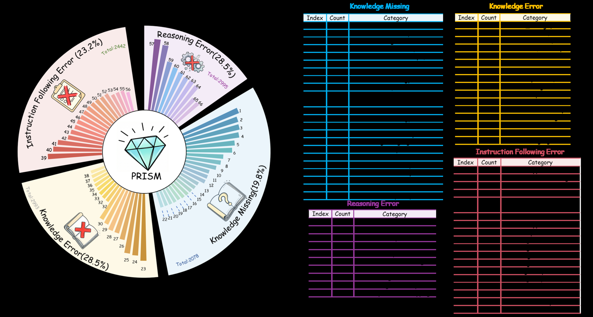
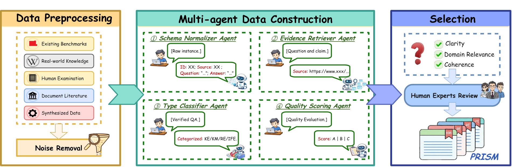
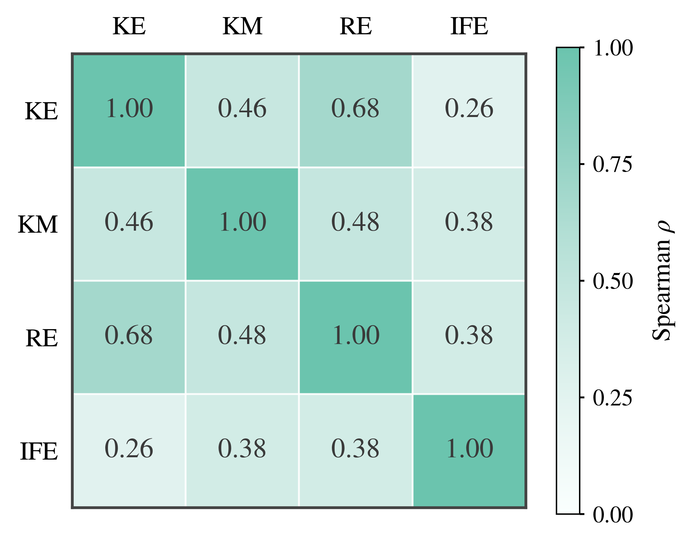

<div align="center">

<picture>
  <source media="(prefers-color-scheme: dark)" srcset="assets/prism-dark.png">
  
</picture>

# PRISM

### Probing Reasoning, Instruction, and Source Memory in LLM Hallucinations

<em>A diagnostic benchmark that tells you <b>where</b> and <b>why</b> a language model hallucinates, not just how often.</em>

<br>

Yuhe Wu<sup>1</sup>, Guangyu Wang<sup>2,3</sup>, Yuran Chen<sup>3</sup>, Jiatong Zhang<sup>3</sup>, Yutong Zhang<sup>3</sup>,<br>
Yujie Chen<sup>4</sup>, Jiaming Shang<sup>5</sup>, Guang Zhang<sup>1,†</sup>, Zhuang Liu<sup>3,†</sup>

<p>
  <a href="https://www.hkust-gz.edu.cn/"></a>
  &nbsp;&nbsp;
  <a href="https://shanghai.nyu.edu/"></a>
  &nbsp;&nbsp;
  <a href="https://www.dufe.edu.cn/"></a>
  &nbsp;&nbsp;
  <a href="https://www.cuhk.edu.cn/"></a>
  &nbsp;&nbsp;
  <a href="https://www.cufe.edu.cn/"></a>
</p>

<sup>1</sup><a href="https://www.hkust-gz.edu.cn/">HKUST(GZ)</a>
&nbsp;&nbsp;
<sup>2</sup><a href="https://shanghai.nyu.edu/">NYU Shanghai</a>
&nbsp;&nbsp;
<sup>3</sup><a href="https://www.dufe.edu.cn/">DUFE</a>
&nbsp;&nbsp;
<sup>4</sup><a href="https://www.cuhk.edu.cn/">CUHK(SZ)</a>
&nbsp;&nbsp;
<sup>5</sup><a href="https://www.cufe.edu.cn/">CUFE</a>

<sup>†</sup>Corresponding authors: <a href="mailto:guangzhang@hkust-gz.edu.cn">guangzhang@hkust-gz.edu.cn</a>, <a href="mailto:liuzhuang@dufe.edu.cn">liuzhuang@dufe.edu.cn</a>

<br>

[](https://aclanthology.org/2026.acl-long.1551/)
[](https://arxiv.org/abs/2604.16909)
[](https://doi.org/10.18653/v1/2026.acl-long.1551)
[](https://acl-prism.cc/)
[](https://acl-prism.cc/)

[](data/README.md)
[](pyproject.toml)
[](LICENSE)
[](DATA_LICENSE)

<br>

<table align="center">
  <tr>
    <td align="center" width="140"><h3>4</h3><sub>failure dimensions</sub></td>
    <td align="center" width="140"><h3>65</h3><sub>sub-tasks</sub></td>
    <td align="center" width="140"><h3>9,448</h3><sub>instances</sub></td>
    <td align="center" width="140"><h3>24</h3><sub>LLMs evaluated</sub></td>
    <td align="center" width="140"><h3>3</h3><sub>generation stages</sub></td>
  </tr>
</table>

</div>

> **TL;DR.** Hallucination benchmarks usually mix everything into one query and score the final output,
> which says how often a model fails but not where it fails. PRISM turns the evaluation into a
> diagnosis: every item probes exactly one stage of generation, so a failure is attributable to
> **knowledge error (KE)**, **knowledge missing (KM)**, **reasoning error (RE)**, or
> **instruction-following error (IFE)**. The benchmark has **9,448 items in 65 sub-tasks**, and the
> 24 models we evaluated trade these dimensions against each other rather than improving on all of them.

## 📰 News

- **2026-09** — The benchmark, the evaluation code, and the prompts are released in this repository.
- **2026-07** — The paper appears in the [ACL 2026 proceedings](https://aclanthology.org/2026.acl-long.1551/) (Main Conference).
- **2026-04** — PRISM is accepted to ACL 2026 (Main Conference) and the preprint is posted on [arXiv](https://arxiv.org/abs/2604.16909).

## 🧭 Contents

- [Overview](#-overview)
- [The PRISM Benchmark](#-the-prism-benchmark)
- [Installation](#-installation)
- [Configuration](#%EF%B8%8F-configuration)
- [Running an Evaluation](#%EF%B8%8F-running-an-evaluation)
- [Mitigation and Internal States](#-mitigation-and-internal-states)
- [Prompts](#-prompts)
- [Results](#-results)
- [Repository Structure](#-repository-structure)
- [Citation](#%EF%B8%8F-citation)
- [License](#-license)
- [Contact](#-contact)

## 🔍 Overview

<p align="center">
  
</p>

Existing benchmarks mix query types and score only the final output, so a wrong answer cannot be traced
to its cause. PRISM keeps one failure mode per item and reports a hallucination rate per dimension, so
the result says which stage of generation broke.

| Stage of generation | What can go wrong | Dimension |
|:--|:--|:--|
| **Memory** — retrieving parametric knowledge | the knowledge is there but wrong or outdated | **KE** Knowledge Error |
| | the knowledge is absent and the model should abstain | **KM** Knowledge Missing |
| **Reasoning** — combining the facts | the facts are given, the inference fails | **RE** Reasoning Error |
| **Instruction** — honouring user constraints | the answer is right, the format or constraint is violated | **IFE** Instruction Following Error |

<details>
<summary><b>Abstract</b></summary>

<br>

As large language models (LLMs) evolve from conversational assistants into agents capable of handling
complex tasks, they are increasingly deployed in high-risk domains. However, existing benchmarks largely
rely on mixed queries and posterior evaluation, output-level scoring, which quantifies hallucination
severity but offers limited insight into where and why hallucinations arise in the generation pipeline.
We therefore reformulate hallucination evaluation as a diagnostic problem and propose PRISM, a
controlled benchmark that disentangles hallucinations into four dimensions: knowledge missing, knowledge
errors, reasoning errors, and instruction-following errors, grounded in three stages of generation
(memory, instruction, and reasoning). PRISM contains 9,448 instances across 65 tasks and supports
fine-grained, stage-aware diagnostic evaluation. Evaluating 24 mainstream open-source and proprietary
LLMs, we uncover consistent trade-offs across instruction following, memory retrieval, and logical
reasoning, showing that mitigation strategies often improve specific dimensions at the expense of others.

</details>

## 💎 The PRISM Benchmark

| Dimension | What the item probes | Sub-categories | Sub-tasks | Items |
|:--|:--|:--|--:|--:|
| **KE** Knowledge Error | the model holds the knowledge but it is wrong or outdated | Factual Distortion, Intra-Memory Conflict, Entity-Identity Confusion | 15 | 1,933 |
| **KM** Knowledge Missing | the answer is outside the model's parametric knowledge, so it should abstain | Domain-Specific, Fictional, Timely, Non-Public Knowledge | 22 | 2,078 |
| **RE** Reasoning Error | the facts are in the prompt, the reasoning has to do the work | Logical Fallacy, Procedural Failure, Information Integration Failure, Mathematical Reasoning Failure | 10 | 2,995 |
| **IFE** Instruction Following Error | the output must satisfy explicit constraints | Explicit Format, Length, Language, Complex & Cognitive Load | 18 | 2,442 |
| **Total** | | 15 sub-categories | **65** | **9,448** |

<p align="center">
  
</p>

<p align="center">
  
</p>

The corpus is filtered from 33,334 candidates through cleaning, a four-agent construction stage
(schema normalizer, evidence retriever, type classifier, quality scoring), and expert adjudication by
80 reviewers, which keeps 28.3% of the candidates. The data card in [`data/README.md`](data/README.md)
documents the record format, the per-sub-task counts, and the scoring rules.

> [!IMPORTANT]
> **Scoring.** Each sub-task yields a percentage score S (100 × accuracy, or 100 × s / 5 for the
> LLM-Eval tasks). Its hallucination rate is `H = 100 − S`, a dimension rate is the mean over its
> sub-tasks, and the **𝓗-Score** is the mean of the four dimension rates. **Lower is better everywhere.**

## 🚀 Installation

```bash
git clone https://github.com/Kzczc/ACL2026-PRISM.git
cd ACL2026-PRISM
conda create -n prism python=3.10 -y
conda activate prism
pip install -r requirements.txt
pytest -q          # unit tests; no API key required
python scripts/list_tasks.py
```

## ⚙️ Configuration

`configs/models.yaml` defines the 24 evaluated models and the judge, and reads every
environment-specific value from environment variables written as `${NAME}` or `${NAME:-default}`.

```bash
cp .env.example .env              # fill in keys and endpoints; .env is ignored by git
set -a && source .env && set +a
```

| Variable | Purpose |
|:--|:--|
| `PRISM_API_BASE`, `PRISM_API_KEY` | OpenAI-compatible endpoint used for most models |
| `DEEPSEEK_API_BASE`, `DEEPSEEK_API_KEY` | DeepSeek official API (DeepSeek-V3.2, DeepSeek-R1) |
| `VLLM_API_BASE`, `VLLM_API_KEY`, `LOCAL_SERVED_MODEL` | locally served model, e.g. `vllm serve <path> --served-model-name <name>` |
| `JUDGE_API_BASE`, `JUDGE_API_KEY`, `JUDGE_MODEL` | judge model; the paper uses GPT-4o |
| `PRISM_DATA_DIR` | data directory; empty means `./data` |
| `<MODEL>_MODEL` | served model name when your provider differs from the defaults in `configs/models.yaml` |

> [!NOTE]
> The repository contains no API key, endpoint, or local model path. Everything machine-specific lives in
> your `.env`, which is ignored by git.

## ▶️ Running an Evaluation

**1. Generate responses.** Each request is the task prompt followed by the question, with the sampling
parameters of the paper: temperature 0.8 / top-p 0.8 for KE, KM, IFE and the open-ended RE tasks, and
temperature 0.4 / top-p 0.95 for the closed-ended RE tasks.

```bash
python scripts/run_inference.py --model gpt-4o                 # all 65 sub-tasks
python scripts/run_inference.py --model gpt-4o --tasks KE RE-LF --limit 20   # subset, smoke test
```

Responses are written to `outputs/<model>/responses/<task id>.jsonl` and an interrupted run resumes.

**2. Score them.** Rule-based tasks are scored offline; KE semantic matching, mathematics, code, and
the information-integration tasks call the judge, and every judgment is cached in
`outputs/<model>/scores/`.

```bash
python scripts/run_evaluation.py --model gpt-4o
python scripts/make_tables.py --models gpt-4o deepseek-v3.2 --report reports/results.md
```

`run_evaluation.py` prints the four dimension rates and the 𝓗-Score and writes
`outputs/<model>/summary.json`.

> [!TIP]
> **Evaluating your own model.** Add an entry to `configs/models.yaml`, or write your responses directly
> as `outputs/<name>/responses/<task id>.jsonl` with one `{"id": ..., "response": ...}` per line and run
> step 2.

## 🧪 Mitigation and Internal States

These two scripts cover the discussion section: the fine-tuning used for the mitigation comparison and
the measurements behind the attention analysis. Both run on a local model
(`pip install -e ".[train,analysis]"`).

**LoRA fine-tuning on a reasoning dataset.** The adapter is merged into the base weights, so the result
is served and evaluated like any other model.

```bash
python scripts/train_reasoning_lora.py --base-model "$SFT_BASE_MODEL" \
    --output-dir runs/llama31-8b-reasoning --merge
vllm serve runs/llama31-8b-reasoning/merged --served-model-name llama-3.1-8b-reasoning --port 8000
LOCAL_SERVED_MODEL=llama-3.1-8b-reasoning python scripts/run_inference.py --model deepseek-r1-distill-32b
```

**Internal states.** For every response the script counts the MLP neurons that fire, measures how
concentrated the attention distributions are (`1 - H(a)/log n`), and estimates the FLOPs of the forward
pass, then reports the means for refusals and for ordinary answers.

```bash
python scripts/analyze_internals.py --model-path "$LOCAL_MODEL_PATH" --tasks IFE --limit 50 \
    --report reports/internals.json
python scripts/analyze_internals.py --model-path "$LOCAL_MODEL_PATH" \
    --attention-map KE-EIC-SelfBuilt-0001 KM-TK-Numeric-0001 --output-dir reports/attention
```

## 💬 Prompts

`prompts/tasks/` holds one prompt per sub-category (three separate ones for KE-EIC and one per RE
sub-task), exactly as used for the reported results. `prompts/judges/` holds the judging prompts of
Appendix J, and `prompts/construction/` the four data-construction agent prompts of Appendix K.2.
All model answers are produced in a single turn, and the evaluated model sees the prompt followed by
the question.

## 🏆 Results

The numbers below are the ones reported in the paper. All values are hallucination rates in percent;
**lower is better**. The interactive leaderboard with per-sub-category breakdowns lives at
[acl-prism.cc](https://acl-prism.cc/).

**Leaderboard snapshot — 𝓗-Score ↓**

| Rank | Model | Type | KE | KM | RE | IFE | 𝓗-Score |
|:--:|:--|:--|--:|--:|--:|--:|--:|
| 🥇 | Claude-Opus-4.5 | Proprietary | 13.80 | 6.35 | 19.68 | 15.77 | **13.90** |
| 🥈 | Gemini-3-Pro | Proprietary | 16.31 | 12.80 | 17.19 | 10.85 | **14.29** |
| 🥉 | Gemini-3-Flash | Proprietary | 16.48 | 8.12 | 21.59 | 16.00 | **15.55** |
| 4 | GPT-5.2 | Proprietary | 17.83 | 5.57 | 24.67 | 15.35 | 15.85 |
| 5 | Claude-Sonnet-4.5 | Proprietary | 16.11 | 7.03 | 23.53 | 16.87 | 15.89 |
| 6 | Qwen3-235B-Instruct | Open-source (best) | 17.37 | 7.00 | 25.89 | 17.87 | 17.03 |

<details open>
<summary><b>Table 2 — Main results (24 models)</b> &nbsp;·&nbsp; <b>bold</b> marks the best model per column within each group</summary>

<br>

| Type | Model | Size | Think | KE | KM | RE | IFE | 𝓗-Score |
|:--|:--|:--|:--:|--:|--:|--:|--:|--:|
| Proprietary | GPT-5.2 | - | ✓ | 17.83 | **5.57** | 24.67 | 15.35 | 15.85 |
| Proprietary | GPT-5.1 | - | ✓ | 25.83 | 11.46 | 26.01 | 25.62 | 22.23 |
| Proprietary | GPT-4o-20241120 | - | ✗ | 19.36 | 8.90 | 29.72 | 16.78 | 18.69 |
| Proprietary | Gemini-3-Pro | - | ✓ | 16.31 | 12.80 | **17.19** | **10.85** | 14.29 |
| Proprietary | Gemini-3-Flash | - | ✓ | 16.48 | 8.12 | 21.59 | 16.00 | 15.55 |
| Proprietary | Gemini-2.5-Pro | - | ✓ | 25.33 | 8.99 | 21.63 | 13.84 | 17.45 |
| Proprietary | Gemini-2.5-Flash | - | ✓ | 19.29 | 8.74 | 31.58 | 15.51 | 18.78 |
| Proprietary | Claude-Opus-4.5 | - | ✓ | **13.80** | 6.35 | 19.68 | 15.77 | **13.90** |
| Proprietary | Claude-Sonnet-4.5 | - | ✓ | 16.11 | 7.03 | 23.53 | 16.87 | 15.89 |
| Proprietary | Claude-Haiku-4.5 | - | ✓ | 18.13 | 7.24 | 25.59 | 18.15 | 17.28 |
| Proprietary | Grok-4.1 | - | ✗ | 19.20 | 17.03 | 34.94 | 20.04 | 22.80 |
| Proprietary | Grok-4-0709 | - | ✗ | 18.35 | 14.57 | 30.97 | 15.74 | 19.91 |
| Open-source | DeepSeek-V3.2 | 685B | ✗ | 17.99 | 7.94 | 28.31 | 14.31 | 17.14 |
| Open-source | DeepSeek-R1 | 671B | ✓ | 18.87 | 10.13 | 28.04 | **11.97** | 17.25 |
| Open-source | DeepSeek-R1-Distill-32B | 32B | ✓ | 18.14 | 11.27 | 30.40 | 18.71 | 19.63 |
| Open-source | Qwen3-235B-Instruct | 235B | ✓ | **17.37** | 7.00 | **25.89** | 17.87 | **17.03** |
| Open-source | Qwen2.5-72B-Instruct | 72B | ✗ | 18.56 | 8.61 | 27.68 | 18.43 | 18.32 |
| Open-source | GLM-4.5 | 355B | ✓ | 18.85 | 10.70 | 29.34 | 15.06 | 18.49 |
| Open-source | GLM-4 | 32B | ✗ | 26.20 | 16.17 | 35.57 | 25.34 | 25.82 |
| Open-source | Llama-4-Scout | 17B | ✗ | 23.67 | 7.58 | 32.19 | 14.17 | 19.40 |
| Open-source | Llama-3.3-70B-Instruct | 70B | ✗ | 19.75 | **6.24** | 29.47 | 13.13 | 17.15 |
| Open-source | Llama-3.1-8B-Instruct | 8B | ✗ | 25.53 | 14.04 | 54.50 | 23.36 | 29.36 |
| Open-source | Llama-3-70B-8192 | 70B | ✗ | 20.70 | 7.43 | 37.50 | 15.83 | 20.37 |
| Open-source | Llama-3-8B-Instruct | 8B | ✗ | 23.15 | 18.42 | 54.02 | 32.53 | 32.03 |

</details>

Claude-Opus-4.5, Gemini-3-Pro, and Gemini-3-Flash lead overall. RE and KE separate models the most,
while KM rates stay low for almost everyone, and open-source models have closed the gap on KM but not
on RE and IFE.

<details>
<summary><b>Table 3 — Mitigation strategies do not improve every dimension (Llama-3.1-8B)</b></summary>

<br>

| Dataset | Base 1-shot | 0-shot | 3-shot | Instruct 1-shot | Reasoning SFT 1-shot |
|:--|--:|--:|--:|--:|--:|
| KE | 43.15 | 43.88 | 43.04 | 38.61 | 67.02 |
| KM | 11.95 | 13.28 | 11.79 | 11.78 | 29.56 |
| IFE | 35.28 | 35.53 | 35.03 | 33.76 | 61.87 |
| RE (Mathematics) | 94.99 | 95.71 | 94.81 | 95.17 | 89.09 |

Instruction tuning helps knowledge conflicts and instruction following but costs reasoning, and
reasoning SFT repairs mathematics while degrading the other three dimensions.

</details>

**Dimension correlation.** Model rankings agree only partially across dimensions: KE correlates most
with RE and least with IFE, so a single hallucination score hides the trade-offs.

<p align="center">
  
</p>

<details>
<summary><b>Reproducing the reported numbers</b></summary>

<br>

The released evaluators reproduce the paper exactly on the rule-based sub-tasks: re-scoring our stored
GPT-5.2 outputs gives identical values for KM (abstention), KE-EIC, KE-IMC-Text, all RE-LF and RE-PF
sub-tasks, IFE-LC, and IFE-LgC. Three groups differ by construction:

- **KM-DSK judgement subsets** (PubMedQA, RAG-QA-Leaderboard, StrategyQA) are scored against the
  `[TRUE]`/`[FALSE]` labels shipped with the original datasets.
- **IFE** items are checked against every instruction they carry, in the strict IFEval sense, instead
  of the main constraint only.
- **Empty responses and API errors** count as failures rather than being dropped from the denominator.

</details>

## 📁 Repository Structure

```text
ACL2026-PRISM/
├── assets/                     # figures and logos used in this README
├── data/                       # the benchmark: 65 JSONL files, tasks.json, and the data card
├── prompts/
│   ├── tasks/                  # the prompt of every sub-task
│   ├── judges/                 # judging prompts (Appendix J)
│   └── construction/           # the four construction-agent prompts (Appendix K.2)
├── prism/
│   ├── tasks.py                # registry of the 65 sub-tasks
│   ├── data.py, prompts.py     # data loading and prompt construction
│   ├── client.py, config.py    # OpenAI-compatible client and the model registry
│   ├── sampling.py             # sampling parameters per dimension
│   ├── judge.py                # LLM judge (GPT-4o by default)
│   ├── evaluators/             # rule-based and judge-based scoring, IFEval checks
│   ├── metrics.py              # S, per-dimension H, H-Score
│   └── internals.py            # active neurons, attention concentration, FLOPs, refusal detection
├── scripts/                    # list_tasks, run_inference, run_evaluation, make_tables,
│                               # train_reasoning_lora, analyze_internals
├── tests/                      # unit tests, including a check that the aggregation reproduces Table 2
├── configs/models.yaml         # 24 models and the judge; values come from environment variables
└── .env.example
```

## ✍️ Citation

If PRISM is useful in your research, please cite the ACL 2026 paper:

```bibtex
@inproceedings{wu-etal-2026-prism,
    title     = "{PRISM}: Probing Reasoning, Instruction, and Source Memory in {LLM} Hallucinations",
    author    = "Wu, Yuhe and Wang, Guangyu and Chen, Yuran and Zhang, Jiatong and Zhang, Yutong and
                 Chen, Yujie and Shang, Jiaming and Zhang, Guang and Liu, Zhuang",
    editor    = "Liakata, Maria and Moreira, Viviane P. and Zhang, Jiajun and Jurgens, David",
    booktitle = "Proceedings of the 64th Annual Meeting of the Association for Computational Linguistics (Volume 1: Long Papers)",
    month     = jul,
    year      = "2026",
    address   = "San Diego, California, United States",
    publisher = "Association for Computational Linguistics",
    url       = "https://aclanthology.org/2026.acl-long.1551/",
    doi       = "10.18653/v1/2026.acl-long.1551",
    pages     = "33619--33656"
}
```

## 📄 License

The code is released under the [MIT License](LICENSE) and the PRISM annotations under
[CC BY-NC 4.0](DATA_LICENSE). Sub-tasks derived from public datasets remain subject to the licenses of
those datasets; see the [data card](data/README.md).

## 📬 Contact

Questions, issues, or a model you would like to see on the leaderboard? Open an
[issue](https://github.com/Kzczc/ACL2026-PRISM/issues) or write to
[yuhewu@hkust-gz.edu.cn](mailto:yuhewu@hkust-gz.edu.cn) ·
[guangzhang@hkust-gz.edu.cn](mailto:guangzhang@hkust-gz.edu.cn) ·
[liuzhuang@dufe.edu.cn](mailto:liuzhuang@dufe.edu.cn).

<br>

<div align="center">
  <sub>⭐ If PRISM helps your work, a star on this repository is much appreciated.</sub>
  <br>
  <a href="#readme">Back to top ↑</a>
</div>
